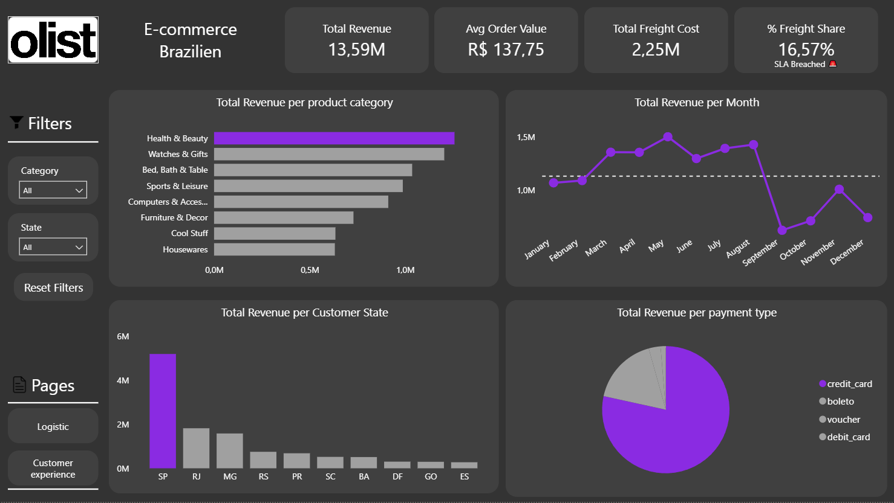
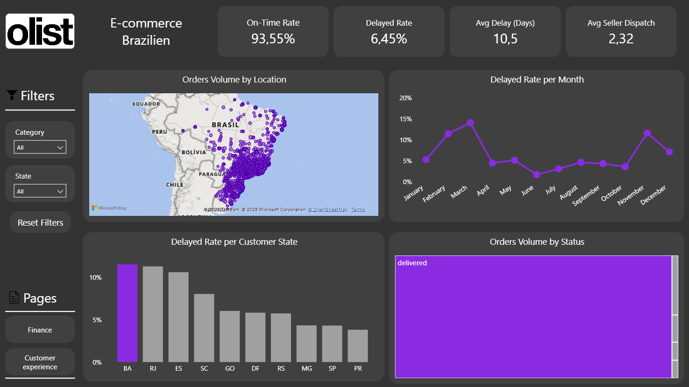
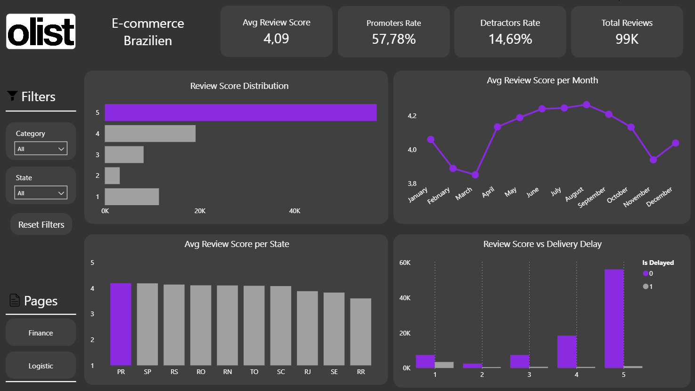

# Olist E-Commerce Analytics

## Project Introduction

Hello! This is a hands-on project where I aimed to simulate the full end-to-end workflow of a real-world data analyst. I used Olist's public e-commerce dataset to practice building an automated Data Extraction, Transformation, and Loading (ETL) pipeline in Python, modeling data in SQL Server, and designing an interactive dashboard in Power BI.

The main goal was to answer real business questions: **Where is the operation losing money? Why are customers dissatisfied?**

> **Data Source:** [Olist E-Commerce Dataset on Kaggle](https://www.kaggle.com/datasets/olistbr/brazilian-ecommerce)

---

## Business Problem & Context

An e-commerce marketplace like Olist faces complex operational challenges across seller dispatch delays, carrier delivery bottlenecks, and high freight costs. These operational friction points directly impact customer satisfaction (CSAT) and result in negative review scores, customer churn, and unexpected logistics expenses.

To address these challenges, the analysis was designed to answer three core business questions:
1. **Financial Optimization:** Where are the primary cost drivers in freight, and how does shipping affect overall revenue?
2. **Operational Bottlenecks:** Which geographic regions suffer from the highest delivery delay rates, and at what stage of the shipping process do delays occur?
3. **Customer Experience Impact:** What is the quantifiable impact of shipping delays on customer review ratings (1 to 5 stars)?

---

## What I Built

### 1. Data Engineering & Cleaning
Before creating any visuals, I had to clean and organize the raw data:
* **Data Cleaning:** Removed duplicates to prevent double-counting revenue and systematically handled missing values.
* **Feature Engineering:** Built essential business metrics, such as `delay_days`, `is_delayed`, and `seller_dispatch_days` (time taken by the seller to hand over the product to the carrier).
* **Automated Data Loading:** Connected Python to SQL Server using `SQLAlchemy`, uploading data in batches to optimize system memory usage.

### 2. Interactive Dashboard
Created an executive report structured around three key business areas:
* **Financial:** Revenue, average order value (AOV), and freight cost impact.
* **Logistics:** On-time vs. delayed delivery rates and regional shipping bottlenecks.
* **CX (Customer Experience):** Analyzing how delivery delays impact review scores.

---

## Key Findings & Business Recommendations

### Core Insights
* **Financial Impact:** Freight accounts for **16.57%** of total company revenue ($2.25M out of $13.59M), signaling an opportunity to renegotiate carrier contracts.
* **Logistics Bottleneck:** While the overall delay rate is 6.45%, late deliveries suffer an average delay of **10.5 days past the estimated delivery date**. The states facing the highest delay rates are **BA, RJ, and ES**.
* **Customer Impact:** The data confirms a strong correlation between delivery delays and 1-star / 2-star reviews.

### Actionable Business Recommendations
1. **Carrier Renegotiation:** Re-evaluate SLA contracts and shipping rates with carriers operating in high-delay regions (BA, RJ, ES).
2. **Seller Dispatch Monitoring:** Implement automated alerts for sellers exceeding the expected dispatch timeframe to reduce initial order processing time.
3. **Proactive Retention:** Offer automated retention vouchers to customers experiencing delays exceeding 3 days to mitigate negative review scores.

---

## Dashboard Overview

### 1. Financial Performance

### 2. Logistics & Operations

### 3. Customer Experience

---

## Repository Structure

| Directory / File | Description |
| :--- | :--- |
| `data_raw/` | Raw Olist CSV datasets |
| `src/` | Exploratory data analysis & ETL logic |
| `sql/` | Automated Python ETL script & DB configuration |
| `power_bi/` | Dashboard screenshots and Power BI interactive report |

---

## How to Run and Explore the Project Locally
Follow these step-by-step instructions to set up the environment, run the pipeline, and explore the complete analysis:

### 1. Prerequisites & Environment Setup
1. Clone the Repository:
git clone (https://github.com/LennOak/DataAnalytics-Ecommerce).git
2. cd DataAnalytics-Ecommerce

3. Set Up a Virtual Environment (Recommended):
python -m venv venv

On Windows:
venv\Scripts\activate

On Mac/Linux:
source venv/bin/activate

4. Install Dependencies:
pip install -r requirements.txt

### 2. Database Configuration (SQL Server)
1. Ensure SQL Server and SQL Server Management Studio (SSMS) (or Azure Data Studio / DBeaver) are installed and running.

2. Create a local database named Olist_Analytics.

3. Configure your connection parameters inside scripts/config.py (or via environment variables) to point to your local SQL Server instance:
SERVER = 'config.DB_SERVER'
DATABASE = 'config.DB_NAME'
DRIVER = 'ODBC Driver 17 for SQL Server'

### 3. Run the Automated ETL Pipeline
1. Ensure the raw Olist CSV datasets are located inside the data_raw/ directory.

2. Execute the main Python ETL script to clean data, engineer metrics, and load processed tables into SQL Server:
python scripts/etl_pipeline.py

3. Alternatively, open Jupyter Notebook to inspect the transformation logic step-by-step:
jupyter notebook notebooks/01_data_cleaning_etl.ipynb

### 4. Verify Database Records
1. Open your SQL client (SSMS) and connect to Olist_Analytics.

2. Run a quick validation query to confirm table creation and data loading:
SELECT TOP 10 * FROM vw_fact_orders;

### 5. Access the Power BI Dashboard
1. Install Power BI Desktop.

2. Open the file Olist_Analytics_Dashboard.pbix located in the repository.

3. Rebind Data Source (If Prompted):

4. Go to Transform Data > Data Source Settings.

5. Select the local SQL Server data source and click Change Source.

6. Update the Server and Database names to match your local setup.

7. Click Apply Changes and Refresh to populate the report.

8. Explore the interactive pages to test dynamic cross-filtering and rank-1 conditional highlighting.

---

## Author

* **Eduardo de Carvalho**
* **LinkedIn:** https://www.linkedin.com/in/eduardo-carvalho-b19681306
* **Email:** ec.eduardocarvalho14@gmail.com
